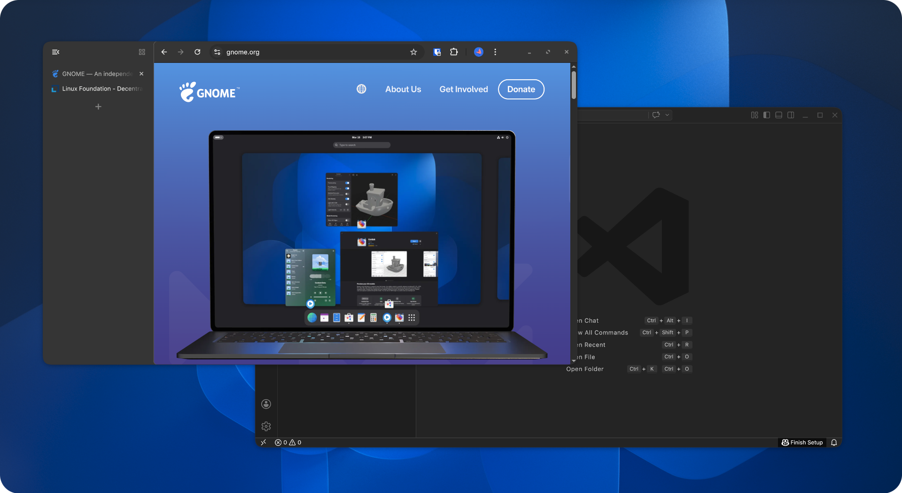

<div align="center">
  <h1>Rounded Windows - Lite</h1>
  <p><i>An opinionated GNOME extension for lightweight, squircle-style window corners</i></p>
  
</div>
<br>

> [!NOTE]
> This project is a fork of [flexagoon/rounded-window-corners](https://github.com/flexagoon/rounded-window-corners). 

## Philosophy

Rounded Windows - Lite is intentionally opinionated:

- **Just works** — install it and every window gets smooth, rounded corners. No tweaking required.
- **Squircle corners** — uses superelliptical curves inspired by Apple's design language instead of plain circular arcs, giving windows a softer, more natural look.
- **Stays out of the way** — no settings panel, no preferences window, no D-Bus services running in the background. The extension does one thing and does it well.
- **Lightweight** — the GPU shader is only 43 lines with zero branching, and redundant work is aggressively cached. You shouldn't notice it's running.
- **Plays nice with others** — apps that already round their own corners (GTK 4 / LibAdwaita, LibHandy) are automatically detected and skipped, so you never get double-rounded windows.
- **Easy to maintain** — small, modular codebase with minimal coupling to GNOME Shell internals, making it easier to keep up with GNOME updates.

## Why this fork exists

The original extension interacts with many GNOME Shell private APIs. That makes maintenance harder over time, especially across GNOME updates.

This fork aims to stay lean and straightforward by reducing complexity and avoiding extra configuration features.

## Changes from upstream

This fork is a significant refactor of the original extension — roughly **11,000 lines removed** and the remaining code restructured into focused modules.

For a full technical breakdown (removed subsystems, shader rewrite, performance work, lifecycle fixes), see **[CHANGES.md](CHANGES.md)**.

## Installation

### From Gnome Extensions

> [!WARNING]
> This extension is still in development and is not published on extensions.gnome.org.

### From source code

1. Install the dependencies:
    - Node.js
    - npm
    - gettext
    - [just](https://just.systems)

    Those packages are available in the repositories of most linux distros, so
    you can simply install them with your package manager.

2. Build the extension

    ```bash
    git clone https://github.com/matheus-inacio/rounded-window-corners
    cd rounded-window-corners
    just install
    ```

After this, the extension will be installed to
`~/.local/share/gnome-shell/extensions`.


## Development

Here are the avaliable `just` commands (run `just --list` to see this message):

```bash
Available recipes:
    build   # Compile the extension and all resources
    clean   # Delete the build directory
    install # Build and install the extension from source
    pack    # Build and pack the extension
```